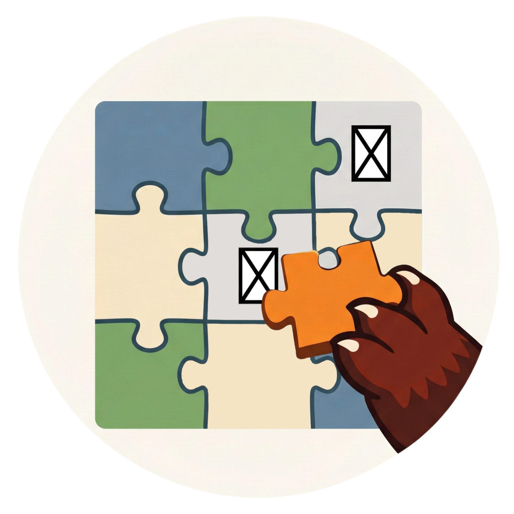

#  RenPatch

**RedPanda RenPatch** is a surgical font optimization tool designed specifically for Ren'Py developers. It solves the "Tofu" (missing character ☒) problem in lightweight fonts by scanning game scripts, identifying missing glyphs, and generating a tiny, high-performance font patch.

---

RedPanda RenPatch（RPRP）是一个为 Ren'Py 引擎设计的字体修复工具，以解决独立游戏开发中的☒缺字问题。RenPatch可以自动扫描游戏脚本文件、对比字库索引来准提取缺失字符，生成体积极小的补丁字库及配套集成的`.rpy`脚本，以供开发者进行字体校准和优化。开发者无需内置更大的完整版字体文件，即可实现更好的跨语言文字显示。

---

## Features (Current Phase: Core Logic / Mannual Mode)

The following core functionalities are currently implemented in `core.py`:

- **Smart Script Scanner**: Recursively scans `.rpy` files to extract unique characters while filtering out code keywords and file paths.
- **Font Introspection**: Uses `fontTools` to analyze the `cmap` of "Lite" fonts and identify exactly which characters the font cannot render.
- **Surgical Subsetting**: Extracts only the missing glyphs from a "Full" donor font, resulting in a `patch.ttf` often smaller than 20KB.
- **Missing Character Reporter**: Generates a detailed Markdown report with Hex codes and direct links to Unicode wikis (Compart) for every missing character.
- **Automated Ren'Py Integration**: Generates a drop-in `.rpy` script with explicit `FontGroup` mapping to ensure Ren'Py prioritizes the patch for problematic characters.

---

## How to Use

Currently, the tool operates as a Python backend. See more on the `test.py` file as example:

1. Place your game project in a directory.
2. Ensure you have your "Lite" font (e.g., `SourceHanSansLite.ttf`) and a "Full" donor font.
3. Run the pipeline in `core.py`:
   ```python
   # 1. Scans scripts
   # 2. Compares fonts
   # 3. Generates patch.ttf
   # 4. Generates renpatch_init.rpy
4. Drop patch.ttf and renpatch_init.rpy into your game/ folder.

5. Update gui.rpy to use renpatch_style.

## Future Versions

Modern GUI (Coming Soon)
- A lightweight, cross-platform app built with Flet.
- Modern Drag & Drop interface for game folders and font files.
- Real-time status console and "One-Click Patch" workflow.
- Designed for RenPy developers and screenwriters to fix missing character problem without any Python knowledges.

Turbo Mode (Coming Soon)
Full Custom Subsetting: Instead of a patch, generate a single, perfectly optimized font containing only the characters used in your game. Largely reduce the font size in your game packages. Built high-performance font solution for your Ren'Py projects.

Multi-language Optimization
Specialized logic for Korean/Japanese support, to drastically reduce font bloat in international releases. Add multi-language font solution to your Ren'Py projects.

---

## License

MIT License

Copyright (c) 2025 Mochiredpanda / Jiyu He